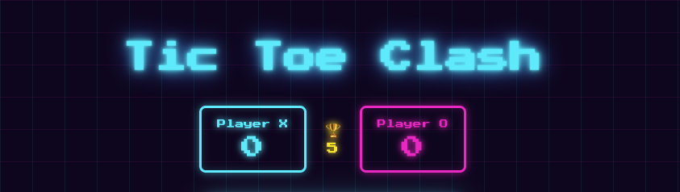

# 🕹️ Tic Toe Clash

A **Tic-Tac-Toe** game with a **neon retro-arcade** look, playable by two players on the same screen. The goal: win a **best-of-5 match** (first to 5 rounds wins).

  



## ✨ Features

- 🎮 **Classic Tic-Tac-Toe** for two players (X vs O)
- 🏆 **Best-of-5 match**: the first player to reach 5 points wins
- 📊 **Neon scoreboard** (cyan for X, magenta for O)
- 🔄 **Alternating starter**: the player who goes first switches every round
- 🎉 **Victory overlay** with an animated trophy and a confetti shower
- 🌈 **Arcade theme**: dark gridded background, neon glow, pixel font _Press Start 2P_
- 📱 **Responsive design**: adapts from mobile to large screens

## 📂 Project structure

```
ticTac/
├── index.html      # Page structure
├── style.css       # Arcade theme + responsive + CSS variables
├── script.js       # Game logic
└── README.md       # This file
```

## 🚀 Run the game

No installation required. Just open `index.html` in a browser:

```bash
open index.html
```

> ℹ️ An **internet connection** is needed on first load to fetch the Google Fonts (_Press Start 2P_ and _Quicksand_).

## 🛠️ Technical details

### Game logic (`script.js`)

- The board is represented by an array of 9 cells.
- Winning combinations are checked with `Array.some()`, draws with `Array.every()`.
- Scores, the target (`OBJECTIF = 5`), and the starting player are tracked with state variables.
- Confetti is generated dynamically in JavaScript (80 `<div>` elements with random position, color, speed, and delay).

### Responsive design (`style.css`)

The site adapts to any screen size **without `@media` queries**, thanks to fluid CSS units and functions:

| Technique           | Purpose                                          |
| ------------------- | ------------------------------------------------ |
| `clamp()`           | Fluid but bounded font sizes and spacing         |
| `min(20rem, 85vw)`  | The board never exceeds 85% of the screen width  |
| `aspect-ratio: 1/1` | The board stays perfectly square                 |
| `flex-wrap: wrap`   | The scoreboard wraps if the screen is too narrow |

### DRY with CSS variables (`:root`)

All design tokens live in a single `:root` block — the **single source of truth**:

```css
:root {
  /* Fonts */
  --font-arcade: "Press Start 2P", cursive;
  --font-body: "Quicksand", sans-serif;

  /* Font sizes */
  --fs-title: clamp(20px, 7vw, 40px);
  --fs-message: clamp(11px, 3.5vw, 16px);
  /* ... */

  /* Neon colors (hex for direct use, -rgb for transparent rgba()) */
  --neon-cyan: #00f0ff;
  --neon-cyan-rgb: 0, 240, 255;
  /* ... */
}
```

Changing a font, a color, or a size in one place updates the whole UI automatically.

## 📐 Understanding `clamp()`

`clamp()` is a CSS function that produces a **fluid** value (one that follows the screen size) while staying **bounded** between a minimum and a maximum. It often replaces several `@media` queries.

### Syntax

```css
clamp(MINIMUM, PREFERRED, MAXIMUM)
```

- **MINIMUM** — the value never goes below this.
- **PREFERRED** — the "fluid" value, usually in `vw` (_viewport width_ = % of the window width). This is what grows or shrinks with the screen.
- **MAXIMUM** — the value never exceeds this cap.

The browser uses the preferred value **unless** it falls outside the `[MINIMUM ; MAXIMUM]` range, in which case it clamps to the nearest bound.

### Example from the project

```css
body {
  gap: clamp(1rem, 4vw, 2rem);
  padding: clamp(1rem, 4vw, 2rem);
}
```

> "Use spacing equal to **4% of the screen width**, but always keep it **between 16px (`1rem`) and 32px (`2rem`)**."

| Screen width | `4vw` computed | `clamp()` result              |
| ------------ | -------------- | ----------------------------- |
| 📱 320px     | 12.8px         | **16px** (clamped to minimum) |
| 📱 480px     | 19.2px         | **19.2px** (preferred value)  |
| 💻 800px     | 32px           | **32px** (clamped to maximum) |
| 🖥️ 1400px    | 56px           | **32px** (clamped to maximum) |

### Why it's useful

- ✅ One line replaces several `@media` queries.
- ✅ The transition is **continuous** (no jump at a fixed breakpoint).
- ✅ Values always stay within a sensible range (never tiny, never huge).

In this project, `clamp()` is used for the title, the message, the X/O symbols, the trophy, and the spacing — it's the core of the responsive layout.

---

## 🔗 Links

[](https://github.com/KaribbeanCreative)
[](https://linkedin.com/in/orianaadon)
[](https://www.instagram.com/karibbean.creative)
[](https://www.behance.net/karibbeancreative)

## 📝 License

This project is licensed under the **MIT License** — see the [LICENSE](LICENSE) file for details.
